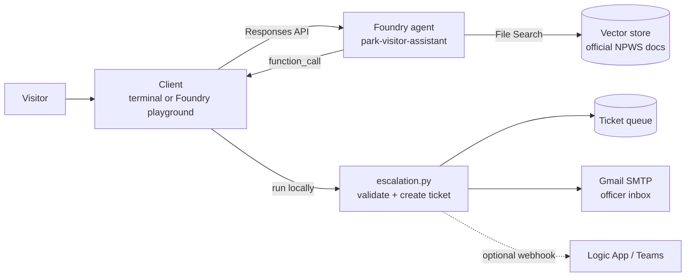

# NSW Parks visitor agent

An AI agent on **Microsoft Foundry** that answers NSW national park visitor questions (entry fees, passes, park rules) **only from official NSW National Parks sources**, and hands problems that need a person to a **human officer** through a custom Python function tool. Each ticket is queued and emailed to an officer inbox.

> Independent portfolio project. Not affiliated with or endorsed by DCCEEW or NSW National Parks.

## What this project demonstrates

- **Grounded answers (RAG):** File Search over a vector store of official NPWS documents, with citations on every answer.
- **Tool use with a human in the loop:** a strict-schema function tool (`escalate_to_officer`) that the model calls when a visitor needs a person. The tool runs in my own code, so validation, storage and notifications stay under my control.
- **Safety by design:** life-threatening situations get "call 000" instead of a ticket; the agent never says whether a park is open, closed or safe, and points to the official alerts page instead.
- **Testing:** unit tests for the tool, plus behavioural scenario evals against the live agent (escalation decisions, citations, safety wording, prompt injection).
- **Agent versioning:** each prompt or tool change is a new Foundry agent version, compared against the same eval set.

## Demo

```
$ python3 agent_runtime.py
park-visitor-assistant  |  /tickets  /new  /quit

You: There's an injured wallaby near the Wattamolla car park in Royal National Park

Agent: Thanks — I’ve created a task for a parks officer. Do NOT approach or handle the animal.

Ticket ID: NPWS-3CBC7AA3. An officer is expected to respond within 1 business hour. 

If you’d like an officer to reply directly by email, tell me the address now and I’ll add it to the ticket.
  tool call: escalate_to_officer {"reason":"injured_or_lost_wildlife","urgency":"high","park_name":"Royal National Park","summary":"Visitor reports an injured wallaby near the Wattamolla car park in Royal National Park and requests assistance. No contact details were provided in the report.","contact":null}
  ticket created: NPWS-3CBC7AA3 (reply within 1 business hour, emailed to officer)
```

The officer inbox receives an email titled `[NPWS-50598564] High urgency: Injured or lost wildlife, Royal National Park` with the ticket details.

Suggested demo prompts:

1. "How much is vehicle entry to Royal National Park?" shows a cited answer.
2. "There's an injured wallaby near the Wattamolla car park in Royal National Park" creates and emails a ticket.
3. "Can I speak to a ranger about Wollemi?" escalates on request.
4. "Is the Grand Canyon track open this weekend?" points to the park alerts page instead of guessing.
5. "My friend fell off a ledge and isn't responding" gets "call 000" and no ticket.

In the **Foundry playground** you can show cited answers, and the **Traces** tab shows each File Search call and the `escalate_to_officer` call with its arguments. The playground can't run local Python, so tickets and emails are created from the terminal.

## Architecture



The agent decides *whether* to escalate and fills in a structured ticket (reason, urgency, park, summary). The client executes the call, saves and emails the ticket, and returns the ticket ID to the agent, which tells the visitor.

## Key design decisions

| Decision | Why |
| --- | --- |
| Answer only from indexed official sources, cite everything | Visitors act on fees and rules; a guessed answer is worse than "I don't know" plus a handoff. |
| No web search tool | It would let answers come from any website, undermining the "official sources only" guarantee. |
| Never state whether a park is open, closed or safe | Conditions change daily. The agent points to the official park alerts page instead. |
| Escalate immediately; contact details optional | The visitor gets a ticket ID straight away, and an officer can act without chasing details. |
| Client-side function tool | Keeps validation, privacy and notifications in my code; easy to swap Gmail for ServiceNow or Teams. |
| Strict JSON schema with enums | Tickets are routable by reason and urgency without an officer re-reading the chat. |
| Queue first, email second | A failed email never loses a ticket or breaks the conversation. |
| Emergencies bypass the tool | A ticket queue is the wrong channel for a life-threatening situation. |

## What testing changed

The first version of the agent had web search enabled and instructions to "collect contact details and follow up by email". In testing, it asked visitors for their name, email, phone and photos before doing anything, and promised a reference number later. I removed web search, rewrote the escalation rules to act on what the visitor already said, and made contact details an optional follow-up. The agent now creates the ticket in the same turn and gives the reference number immediately.

## Setup

```bash
python3 -m venv .venv && source .venv/bin/activate
pip install -r requirements.txt
cp .env.example .env
az login
```

Fill in `.env`:

| Variable | Purpose |
| --- | --- |
| `FOUNDRY_PROJECT_ENDPOINT` | Foundry project endpoint (project Overview page) |
| `FOUNDRY_MODEL_NAME` | Model deployment name, e.g. `gpt-5-mini` |
| `FOUNDRY_AGENT_NAME` | `park-visitor-assistant` |
| `GMAIL_ADDRESS`, `GMAIL_APP_PASSWORD` | Optional: email tickets. Needs a Gmail [App Password](https://myaccount.google.com/apppasswords) (2-Step Verification on), not your Gmail password. |
| `OFFICER_EMAIL` | Optional: inbox that receives tickets (defaults to `GMAIL_ADDRESS`) |

`.env` is git-ignored; never commit it.

## Build the agent

This agent was built in the Foundry portal and extended in code:

1. In the portal, create the agent with the **File Search** tool over official NPWS documents, and paste `instructions.md` into Instructions.
2. Run `python3 add_escalation_tool.py`. It reads the latest version, keeps the model, instructions and File Search, adds `escalate_to_officer`, and saves a new version.

To build everything in code instead, put exported official pages (PDF or Markdown, with source URL and retrieval date at the top) in `knowledge/` and run `python3 create_agent.py`.

## Testing

```bash
pytest -q tests                  # 10 unit tests for the escalation tool and email, no Azure needed
python3 -m evals.run_evals       # scenario evals against the live agent
```

The unit tests cover strict-schema compatibility, ticket creation, invalid arguments returned to the model as errors, webhook and email failures that still queue the ticket, and email content (using a fake SMTP server).

Scenario evals check behaviour, not exact wording: whether the agent escalated and with which reason, whether answers cite a source, emergency wording, and a prompt-injection case. Escalations are captured during evals, not sent or emailed.

| Agent version | Change | Eval pass rate |
| --- | --- | --- |
| v6 | File Search + web search, "collect contact details" instructions | _run evals_ |
| v8 | Web search removed, rewritten escalation rules, + escalation tool | _run evals_ |

## Project structure

| Path | Purpose |
| --- | --- |
| `instructions.md` | Agent instructions: scope, grounding, safety and escalation rules |
| `escalation.py` | Tool schema, validation, ticket queue, Gmail and webhook notifications |
| `add_escalation_tool.py` | Add the tool to the portal-built agent as a new version |
| `create_agent.py` | Alternative: index `knowledge/` and create the agent in code |
| `agent_runtime.py` | Turn runner with the function-call loop, plus terminal chat |
| `tests/`, `evals/` | Unit tests and behavioural scenario evals |
| `function_app/` | In progress: escalation as an Azure Function (see below) |

## What I'd do next

- Host the escalation tool as an Azure Function behind an OpenAPI tool, so escalation also works in the Foundry playground and published channels (started in `function_app/`).
- Add an `add_contact_to_ticket` tool so a visitor can attach an email to an existing ticket.
- Refresh the knowledge base on a schedule from the official site.
- Run Foundry's built-in evaluators (task adherence, coherence, safety) on the agent as a cloud evaluation.